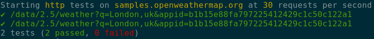

# Smocha
[](https://travis-ci.org/rodrigodiez/smocha)

Smocha is a http [smoke tests](https://en.wikipedia.org/wiki/Smoke_testing_(software)) runner focused on simplicity, readability, and speed.

In Smocha, tests are defined within _yaml_ files called _testbooks_ that describe an http request and the requirements for the response that comes back.

This _configuration over code_ approach helps not only to standardize procedures and terminology across teams but also to better understand a test suite at a glance.



Smocha is written in [Go](https://golang.org/) and inspired by so many other projects such as [Cucumber](https://cucumber.io/) and [Ansible](https://www.ansible.com/).

> Smocha is under heavy development at the moment and while we adhere to [Semantic versioning](https://semver.org/) there are plans to update the _testbook_ yaml structure in the next major version. Bear this in mind when updating your Smocha binary since your old _testbooks_ may stop working properly. Please read [#6](https://github.com/rodrigodiez/smocha/issues/7) for more details


# Features
- Concurrent, throttled http(s) tests
- Non-zero exit code on failure
- Stderr for errors
- Summary of execution
- Partial overrides of _testbooks_ using environment variables


# Testbook example
```yaml
host: myhost.com
schema: https
rate: 20
tests:
- url: /
  should:
    have_status: 200
    contain: success
    have_headers:
      - { name: 'Content-Type', value: 'application/javascript'}
      - { name: 'X-Custom-Header', value: 'foo'}

- url: /json-endpoint
  should:
    have_status: 200
    match_json_schema: ./MyOwnSchema.schema.json
```

# Installation
## Go get
```
go get -u github.com/rodrigodiez/smocha
```
## Binary download
Binaries for Linux, macOS and Windows are available in the [releases](https://github.com/rodrigodiez/smocha/releases) section of this repository

## Brew
Brew installation is not available yet but it will be ready soon. Check [#6](https://github.com/rodrigodiez/smocha/issues/6) for updated details

# Running Smocha
```bash
# testbook file defaults to testbook.yml if not specified
smocha

# you can specify a custom filename
smocha my-testbook-file.yml

# you can also override some testbook values using environment variables
env SMOCHA_HOST=google.com smocha
```
